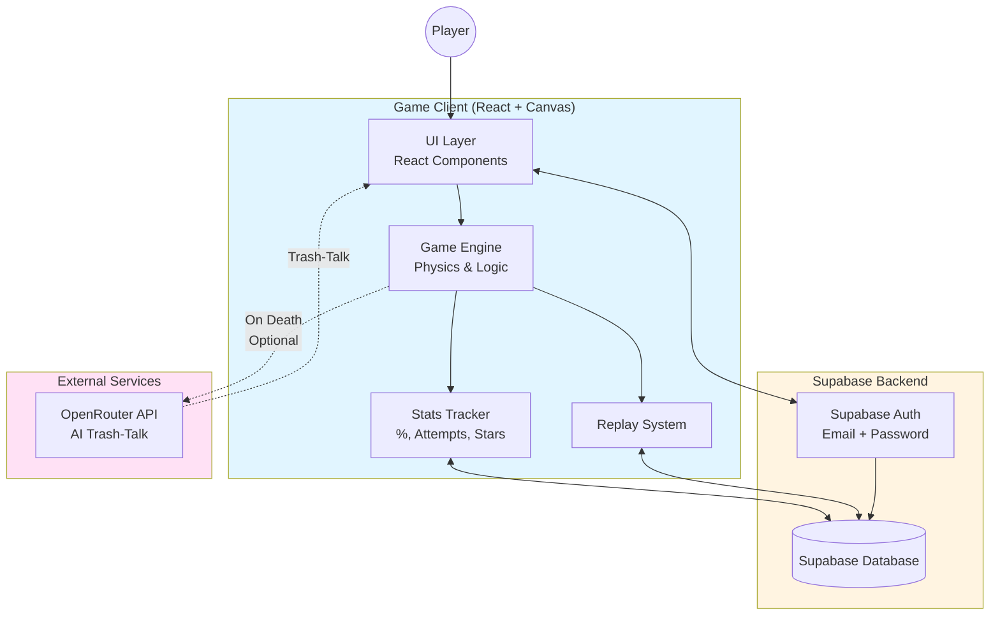
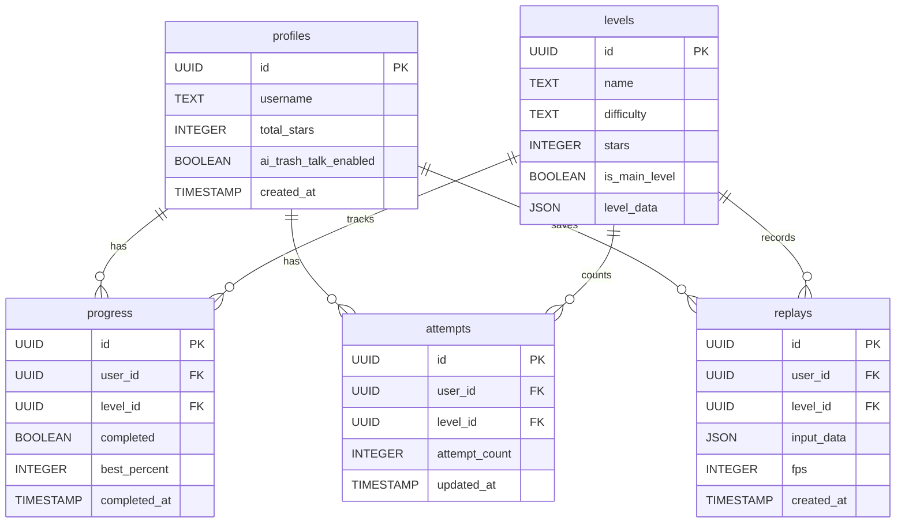
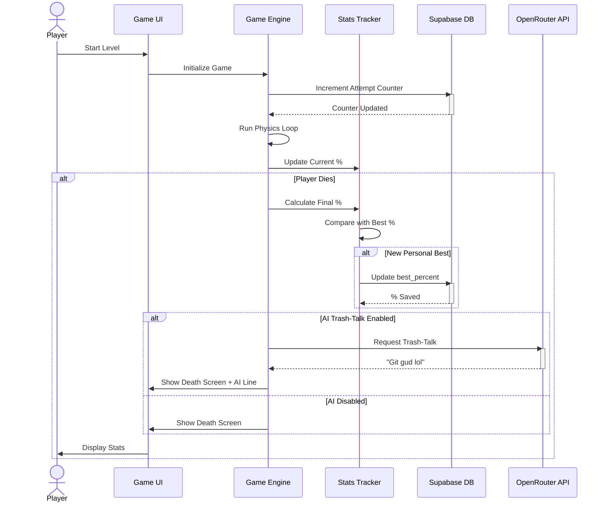
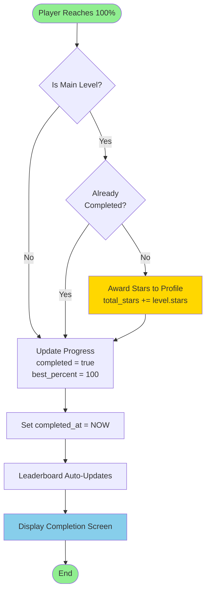
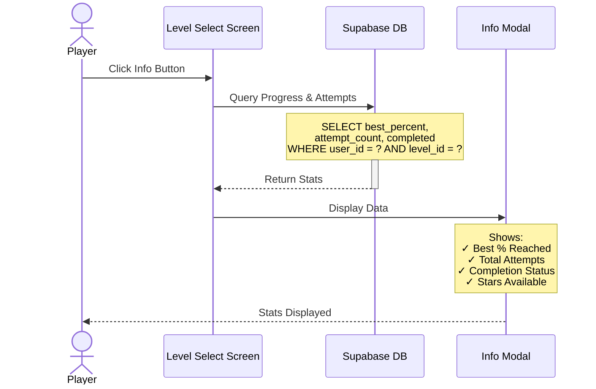
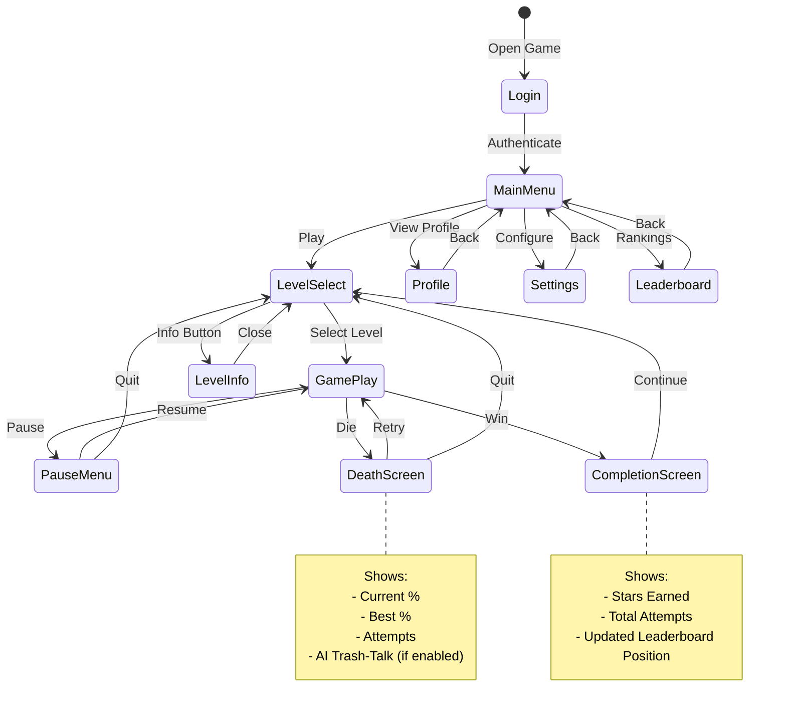
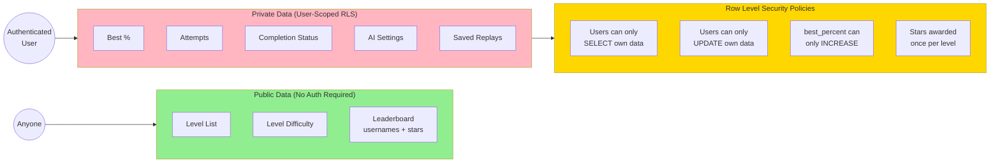
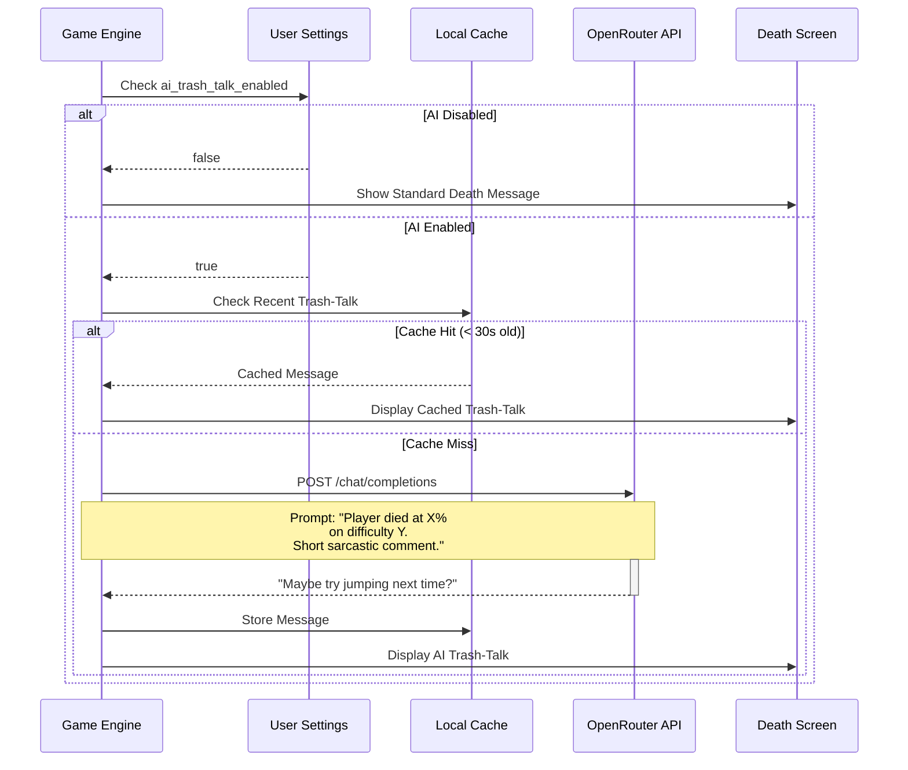
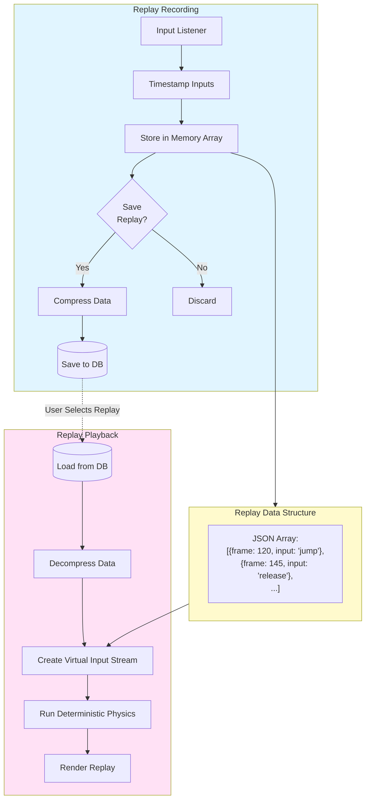

# Pulse Dash - Architecture Diagrams

## 1. System Architecture Overview



## 2. Database Schema Relationships



## 3. Gameplay Flow - Attempt & Death Cycle



## 4. Level Completion & Star Award Flow



## 5. Level Select Info Button Flow



## 6. User Journey - Main Navigation Flow



## 7. Data Security - RLS Policy Structure



## 8. Percentage Tracking System

```mermaid
flowchart TD
    Start([Game Loop Running]) --> CalcDist[Calculate Player Distance]
    CalcDist --> CalcPercent[Calculate %<br/>distance / level_length * 100]
    CalcPercent --> UpdateUI[Update UI Display]

    UpdateUI --> CheckDeath{Player<br/>Died?}

    CheckDeath -->|No| Start
    CheckDeath -->|Yes| GetBest[Fetch best_percent<br/>from DB]

    GetBest --> Compare{current %<br/>> best %?}

    Compare -->|Yes| UpdateDB[UPDATE progress<br/>SET best_percent =<br/>GREATEST(best_percent, current)]
    Compare -->|No| SkipUpdate[No DB Update Needed]

    UpdateDB --> ShowDeath[Show Death Screen<br/>with Stats]
    SkipUpdate --> ShowDeath

    ShowDeath --> End([End Attempt])

    style Start fill:#87CEEB
    style UpdateDB fill:#FFD700
    style ShowDeath fill:#FFB6C1
    style End fill:#FF6B6B
```

## 9. AI Trash-Talk Integration



## 10. Replay System Architecture



---

## Quick Reference: Key Data Operations

### Attempt Increment (Every Game Start)
```sql
INSERT INTO attempts (user_id, level_id, attempt_count)
VALUES (:user_id, :level_id, 1)
ON CONFLICT (user_id, level_id)
DO UPDATE SET attempt_count = attempts.attempt_count + 1
```

### Best Percentage Update (On Death if Higher)
```sql
UPDATE progress
SET best_percent = GREATEST(best_percent, :current_percent)
WHERE user_id = :user_id AND level_id = :level_id
```

### Level Completion + Star Award (100% First Time)
```sql
-- Transaction Start
UPDATE progress SET completed = true, best_percent = 100, completed_at = NOW();
UPDATE profiles SET total_stars = total_stars + :stars WHERE id = :user_id;
-- Transaction End
```
